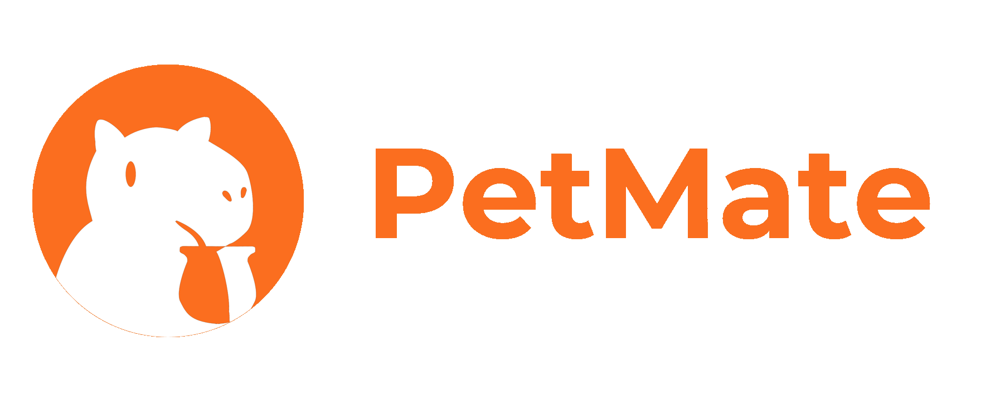

<h2 align="center">MPV Cohort #18 - Holberton School Uruguay</h2>

 We are a group of students from Holberton School Uruguay. For our MVP, we decided to create <strong>PetMate</strong>, an intelligent solution that automates the feeding of your pet. With PetMate, we aim to simplify and optimize this task mainly for pet owners who spend a large part of their time away from home.

Discover more about us in our 
	<a target="_blank"
	href="http://www.petmate.tech/">PetMate</a> 
	page :)

 

## PetMate mobile app
This is an Mobile App project made with **Ionic, Capacitor** and **Typescript**. It can be build to an iOS or Android app.

	<a target="_blank" href="https://en.reactjs.org/">
		</img>
	</a>
	<a target="_blank" href="https://ionicframework.com/">
		</img>
	</a>
	<a target="_blank" href="https://capacitorjs.com/">
		</img>
	</a>
	<a target="_blank" href="https://www.typescriptlang.org/">
		</img>
	</a>

 

## Dependencies
All dependencies that are needed are save in the **node_modules** directory and these metadata can be checked in the **package.json** file.

 

## Main directories and files
-  **src/components**: contains all the components created. Ex. fonts, svg icons, buttons, cards, lists, charts.

- **src/pages**: views of the mobile app. Ex. settings page, progress page, records page.

- **src/styles**: contains the CSS styles of all components and pages

- **App.tsx**: basic React component, essential for the initial working app

 

## Usage example
Clone and access to this repository:

    git clone https://github.com/Holberton-PetMate/mobile-app | cd mobile-app 

Install all dependencies:

    yarn

Start the development server :

    yarn start

## Host
pending
<!-- <a target="_blank" href="https://cloud.google.com/?hl=en">
	</img>
</a> -->

 

## Front-end developers

<a target="_blank" href="https://www.linkedin.com/in/santiago-fern%C3%A1ndez-801641230/">Santiago Fernández</a>,
<a target="_blank" href="https://www.linkedin.com/in/mattobelen/">Belén Matto</a> &
<a target="_blank" href="https://www.linkedin.com/in/ignacio-castro347/">Ignacio Castro</a>

	<a target="_blank"
	href="https://holbertonschool.uy/">
		</img>
	</a>

Montevideo, Uruguay
